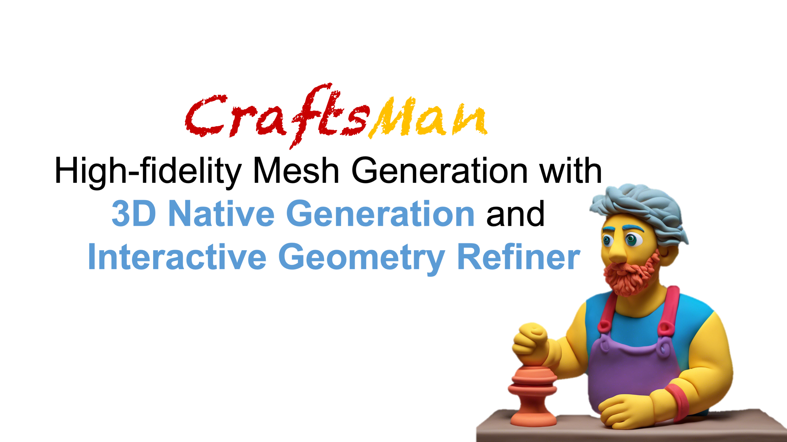

<p align="center">
  
</p>

### <div align="center">匠心：基于3D原生扩模型和交互式几何优化的高质量网格模型生成<div> 
#####  <p align="center"> [Weiyu Li<sup>1,2</sup>](https://wyysf-98.github.io/), Jiarui Liu<sup>1,2</sup>, [Rui Chen<sup>1,2</sup>](https://aruichen.github.io/), [Yixun Liang<sup>3,2</sup>](https://yixunliang.github.io/), [Xuelin Chen<sup>4</sup>](https://xuelin-chen.github.io/), [Ping Tan<sup>1,2</sup>](https://ece.hkust.edu.hk/pingtan), [Xiaoxiao Long<sup>5</sup>](https://www.xxlong.site/)</p>
#####  <p align="center"> <sup>1</sup>香港科技大学, <sup>2</sup>光影幻象, <sup>3</sup>香港科技大学（广州）, <sup>4</sup>腾讯 AI Lab, <sup>5</sup>香港大学</p>
<div align="center">
  <a href="https://craftsman3d.github.io/"></a> &ensp;
  <a href="https://huggingface.co/spaces/wyysf/CraftsMan"></a> &ensp;
  <a href="https://07dbfa9a62ecc6b3f9.gradio.live/"></a> &ensp;
  <a href="https://arxiv.org/pdf/2405.14979"></a> &ensp;
</div>

#### TL; DR: <font color="red">**CraftsMan (又名 匠心)**</font> 是一个两阶段的文本/图像到3D网格生成模型。通过模仿艺术家/工匠的建模工作流程，我们提出首先使用3D扩散模型生成一个具有平滑几何形状的粗糙网格（5秒），然后使用2D法线扩散生成的增强型多视图法线图进行细化（20秒），这也可以通过类似Zbrush的交互方式进行。


## ✨ 总览
这个仓库包含了我们3D网格生成项目的源代码（训练/推理）、预训练权重和gradio演示代码，你可以在我们的[项目页面](https://craftsman3d.github.io/)找到更多的可视化内容以及[演示](https://huggingface.co/spaces/wyysf/CraftsMan)试玩生成结果。如果你有高质量的3D数据或其他想法，我们非常欢迎任何形式的合作。
<details><summary>完整摘要</summary>
我们提出了一个新颖的3D建模系统，匠心。它可以生成具有多样形状、规则网格拓扑和光滑表面的高保真3D几何，并且值得注意的是，它可以和人工建模流程一样以交互方式细化几何体。尽管3D生成领域取得了显著进展，但现有方法仍然难以应对漫长的优化过程、不规则的网格拓扑、嘈杂的表面以及难以适应用户编辑的问题，因此阻碍了它们在3D建模软件中的广泛采用和实施。我们的工作受到工匠建模的启发，他们通常会首先粗略地勾勒出作品的整体形状，然后详细描绘表面细节。具体来说，我们采用了一个3D原生扩散模型，该模型在从基于潜在集的3D表示学习到的潜在空间上操作，只需几秒钟就可以生成具有规则网格拓扑的粗糙几何体。特别是，这个过程以文本提示或参考图像作为输入，并利用强大的多视图（MV）二维扩散模型生成粗略几何体的多个视图，这些视图被输入到我们的多视角条件3D扩散模型中，用于生成3D几何，显著提高其了鲁棒性和泛化能力。随后，使用基于法线的几何细化器显著增强表面细节。这种细化可以自动执行，或者通过用户提供的编辑以交互方式进行。广泛的实验表明，我们的方法在生成优于现有方法的高质量3D资产方面十分高效。
</details>

<p align="center">
  
</p>


## 内容
* [视频](#Video)
* [预训练模型](##-Pretrained-models)
* [Gradio & Huggingface 示例](#Gradio-demo)
* [推理代码](#Inference)
* [训练代码](#Train)
* [数据准备](#data)
* [致谢](#Acknowledgements)
* [引用](#Bibtex)

## 环境搭建

<details> <summary>硬件</summary>
我们在32个A800 GPU上以每GPU 32的批量大小训练模型，训练了7天。

网格细化部分在GTX 3080 GPU上执行。


</details>
<details> <summary>运行环境搭建</summary>

:smiley: 为了方便使用，我们提供了docker镜像文件[Setup using Docker](./docker/README.md).

 - Python 3.10.0
 - PyTorch 2.1.0
 - Cuda Toolkit 11.8.0
 - Ubuntu 22.04

克隆这个仓库.

```sh
git clone git@github.com:wyysf-98/CraftsMan.git
```

安装所需要的依赖包.

```sh
conda create -n CraftsMan python=3.10
conda activate CraftsMan
conda install -c pytorch pytorch=2.3.0 torchvision=0.18.0 cudatoolkit=11.8 && \
pip install -r docker/requirements.txt
```

</details>


# 🎥 视频

[](https://www.youtube.com/watch?v=WhEs4tS4mGo)


# 三维原生扩散模型 (Latent Set Diffusion Model)
我们在这里提供了训练和推理代码，以便于未来的研究。
The latent set diffusion model 在很大程度上基于[Michelangelo](https://github.com/NeuralCarver/Michelangelo),
采用了 [perceiver](https://github.com/google-deepmind/deepmind-research/blob/master/perceiver/perceiver.py) 架构，并且参数量仅为104M.

## 预训练模型
目前，我们提供了以4视图图像作为条件，并通过ModLN将相机信息注入到clip特征提取器的模型。
我们将根据实际情况考虑开源进一步的模型。
```bash
## 您可以直接使用 wget 下载:
wegt https://huggingface.co/wyysf/CraftsMan/blob/main/image-to-shape-diffusion/clip-mvrgb-modln-l256-e64-ne8-nd16-nl6/config.yaml
wegt https://huggingface.co/wyysf/CraftsMan/blob/main/image-to-shape-diffusion/clip-mvrgb-modln-l256-e64-ne8-nd16-nl6/model.ckpt
wegt https://huggingface.co/wyysf/CraftsMan/blob/main/image-to-shape-diffusion/clip-mvrgb-modln-l256-e64-ne8-nd16-nl6-aligned-vae/config.yaml
wegt https://huggingface.co/wyysf/CraftsMan/blob/main/image-to-shape-diffusion/clip-mvrgb-modln-l256-e64-ne8-nd16-nl6-aligned-vae/model.ckpt
## 或者克隆模型仓库:
git lfs install
git clone https://huggingface.co/wyysf/CraftsMan

```
如果使用 wget 下载，应该手动将模型文件放置于 `ckpts/image-to-shape-diffusion/clip-mvrgb-modln-l256-e64-ne8-nd16-nl6` 文件夹。


## Gradio 示例
我们提供了不同的文本/图像到多视角图像扩散模型的gradio演示，例如[CRM](https://github.com/thu-ml/CRM), [Wonder3D](https://github.com/xxlong0/Wonder3D/) and [LGM](https://github.com/3DTopia/LGM). 您可以选择不同的模型以获得更好的结果。要在本地机器上运行gradio演示，请简单运行：

```bash
python gradio_app.py --model_path ./ckpts/image-to-shape-diffusion/clip-mvrgb-modln-l256-e64-ne8-nd16-nl6-aligned-vae
```

## 模型推理
要通过命令行从图像文件夹生成3D网格，简单运行：
```bash
python inference.py --input eval_data --device 0
```

通过下面的代码，可以修改使用的多视角图片推理模型：
```bash
python inference.py --input eval_data --mv_model 'ImageDream' --device 0  # support ['CRM', 'ImageDream', 'Wonder3D']
```

我们默认使用 [rembg](https://github.com/danielgatis/rembg) 来通过前景对象分割。如果输入图像已经有alpha蒙版，请指定no_rembg标志符：
```bash
python inference.py --input 'apps/examples/1_cute_girl.webp' --device 0 --no_rembg
```

如果您有其他视图的图像（左，右，背面），您可以通过下面指令指定图像：
```bash
python inference.py --input 'apps/examples/front.webp' --device 0 --right_view 'apps/examples/right.webp'
```

更多推理配置，请参考 `inference.py`

## 从头开始训练
我们提供了我们的训练代码以方便未来的研究。我们将在接下来的几天内提供少量的数据样本。
有关更多的训练细节和配置，请参考configs文件夹。

```bash
### training the shape-autoencoder
python launch.py --config ./configs/shape-autoencoder/l256-e64-ne8-nd16.yaml \
                 --train --gpu 0

### training the image-to-shape diffusion model
python launch.py --config .configs/image-to-shape-diffusion/clip-mvrgb-modln-l256-e64-ne8-nd16-nl6.yaml \
                 --train --gpu 0

```

# 2D法线增强扩散模型（即将推出）

我们正在努力发布我们的三维网格细化代码。感谢您的耐心等待，我们将为这个激动人心的发展做最后的努力。" 🔧🚀

您也可以在视频中找到网格细化部分的结果。


# ❓常见问题
问题: 如何获得更好的结果？
1. 匠心模型将多视图图像作为3D扩散模型的条件。通过我们的实验，与像([Wonder3D](https://github.com/xxlong0/Wonder3D/), [InstantMesh](https://github.com/TencentARC/InstantMesh/tree/main))这样的重建模型相比， 我们的方法对多视图不一致性更加稳健。由于我们依赖图像到MV模型，输入图像的面对方向非常重要，并且总是会导致良好的重建。
2. 如果您有自己的多视图图像，这将是一个不错的选择来直接进行三维推理。
3. 就像2D扩散模型一样，尝试不同的随机数种子，调整CFG比例或不同的调度器。
4. 我们将在后期考虑提供一个以文本提示为条件的版本，因此您可以使用一些正面和负面的提示。


# 💪 待办事项

- [x]  推理代码
- [x]  训练代码
- [x]  Gradio & Hugging Face演示
- [x]  模型库，我们将在未来发布更多的ckpt
- [ ]  环境设置
- [ ]  数据样本
- [ ]  Google Colab示例
- [ ]  网格细化代码


# 🤗 致谢

- 感谢[光影幻像](https://www.lightillusions.com/)提供计算资源和潘建雄进行数据预处理。如果您对高质量的3D生成有任何想法，欢迎与我们联系！
- Thanks to [Hugging Face](https://github.com/huggingface) for sponsoring the nicely demo!
- Thanks to [3DShape2VecSet](https://github.com/1zb/3DShape2VecSet/tree/master) for their amazing work, the latent set representation provides an efficient way to represent 3D shape!
- Thanks to [Michelangelo](https://github.com/NeuralCarver/Michelangelo) for their great work, our model structure is heavily build on this repo!
- Thanks to [CRM](https://github.com/thu-ml/CRM), [Wonder3D](https://github.com/xxlong0/Wonder3D/) and [LGM](https://github.com/3DTopia/LGM) for their released model about multi-view images generation. If you have a more advanced version and want to contribute to the community, we are welcome to update.
- 感谢 [Objaverse](https://objaverse.allenai.org/), [Objaverse-MIX](https://huggingface.co/datasets/BAAI/Objaverse-MIX/tree/main) 开源的数据，这帮助我们进行了许多验证实验。
- 感谢 [ThreeStudio](https://github.com/threestudio-project/threestudio) 实现了一个完整的框架，我们参考他们出色且易于使用的代码结构。

# 📑许可证
CraftsMan在[AGPL-3.0](https://www.gnu.org/licenses/agpl-3.0.en.html)下，因此任何包含CraftsMan代码或训练模型（无论是预训练还是自定义训练）的下游解决方案和产品（包括云服务）都应该是开源的，以符合AGPL的条件。如果您对CraftsMan的使用有任何疑问，请先与我们联系。

# 📖 BibTeX

    @misc{li2024craftsman,
    title         = {CraftsMan: High-fidelity Mesh Generation with 3D Native Generation and Interactive Geometry Refiner}, 
    author        = {Weiyu Li and Jiarui Liu and Rui Chen and Yixun Liang and Xuelin Chen and Ping Tan and Xiaoxiao Long},
    year          = {2024},
    archivePrefix = {arXiv preprint arXiv:2405.14979},
    primaryClass  = {cs.CG}
    }
